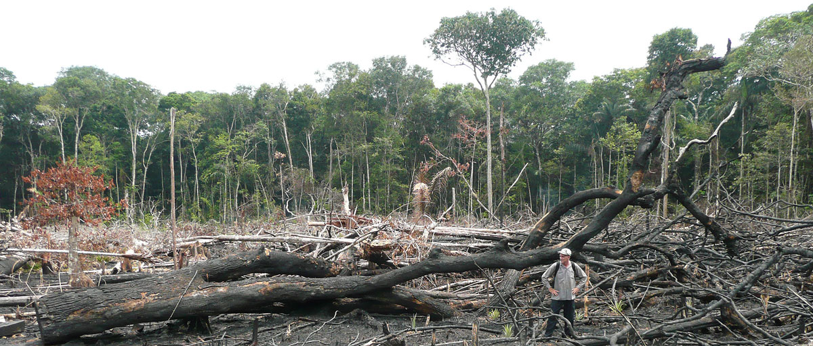

# The Amazon Rainforest and the Impact of Deforestation

Author: James Stipanowich

## Project Overview

The Amazon rainforest is disappearing at an alarming rate. Each year thousands of kilometers of rainforest are destroyed. The Amazon rainforest is the world's biggest rainforest.  The Amazon rainforest offers a huge, living ecosystem that holds about 30 percent of the world's species. The Amazon sustains many people, animal, and plant varieties. What happens if the developing life in this part of the world is destroyed? What massive repercussions could there be on the world as a whole? The Amazon has the power to create its own weather. How will weather patterns change if the Amazon is destroyed? What if people attempt to overtake nature and destroy the Amazon by human means? How will the deforestation of the Amazon influence many aspects of life such as the conquests for forest fires, the configurations of weather phenomena, the growth of population, and the expansion of GDP? Will the Amazon rainforest still exist in years to come if deforestation continues? 

## Business Problem

For this project I am acting as a data scientist with a wildlife organization in Brazil to determine if Amazon deforestation is increasing. I want to determine what factors are impacting the deforestation of the Amazon and on what scale their impact lies.  I plan to predict whether forest fires are correlated with and impacting deforestation and what patterns lie in the occurrences of forest fires for a variety of Brazilian states.

## The Data

The data for my project came from a variety of different sources. 

I compiled three Kaggle datasets for my project from https://www.kaggle.com/mbogernetto/brazilian-amazon-rainforest-degradation. The first Kaggle dataset on Amazon deforestation was originally sourced from The Brazilian Amazon Rainforest Monitoring Program by Satellite. The dataset contains 16 rows and 11 columns. The second Kaggle dataset about fire outbreaks came from The Fires Database at The National Institute for Space Research. The dataset holds 16 rows and 4 columns. The third Kaggle dataset on weather phenomena was initially derived from Golden Gate Weather Services. The dataset has 2104 rows and 6 columns.

I obtained additional data of Brazilian population statistics from https://www.macrotrends.net/countries/BRA/brazil/population. 

I used data of Brazil GDP statistics from The World Bank Group at https://data.worldbank.org/indicator/NY.GDP.PCAP.CD?end=2019&locations=BR&start=1960&view=chart.

All data I included occurred between the years 1999 and 2019.

## Data Preparation

In order to look at the spread of ratings in the dataset for my analyses in this project, I created a graph showing how many ratings were in my dataset and how each movie was rated accordingly within the dataset:

There were 100836 ratings of movies from past viewings of movies in the dataset. The most common movie rating was a '4' rating. However, I opted to look at the most highly rated movies (a '5' rated movie) when making most movie recommendations.

Also, I constructed a graph of the number of rated movies for each unique user in the dataset: 

There were explicit ratings from my dataset. The most number of ratings a single user provided was over 2500, which provides a lot of information for assembling recommendations. Some users only provided a couple of ratings so a filling of missing values occurred in some of my recommedation systems creations to get more similarity information to provide predicted recommendations for some users.

## Data Modeling

After trying different models and code, I chose to go with three different paths to retrieving top 5 movie recommendations. The best model for attaining top 5 movie recommendations was the SVD model.

For my recommendation system methods I decided to find recommendations for user 43 in the dataset who watched the movie, "Toy Story," and rated the movie a '5'. This was a highly rated film and I wanted to find similar such films through recommendation systems.

The SVD model had a solid RMSE of .8724. The SVD model is the best of the models I created with predicted values not far off from actual true values. SVD can deal with a cold start because it provides accurate estimated ratings for unwatched movies. The SVD model had the lowest RMSE of my models. Predictions can be made for any movie in the dataset for user 43 or for any other user. The recommendations provided were highly rated movies. Most movies recommended were released around the same year "Toy Story" was released. 

The KNN model had a higher RMSE than the SVD model. The KNN model determined five similar neighbor users to user 43 who watched the movie, "Toy Story." Most of the movie recommendations from this system were movies released around the same year that Toy Story was released that had high ratings.

The function-based built out method used a Euclidean distance metric to calculate user similarities. The function took out movies that were already watched by the user to increase the chance of unique movie recommendations. The function sorted the movies to only mostly recommend movies rated a '5' to keep with the theme of recommending only highly rated movies.

## The Cold Start Problem

My recommendation systems did well, but how is a common problem known as the cold start problem addressed? The cold start problem occurs where a new user is introduced to the dataset that has not provided a substantial amount of information to make recommendations. The SVD model was included to address the cold start problem. SVD involves the creation of a sparse matrix where user ratings for movies can be inferred based off of a few provided ratings or small amount of information from a new user in relation to already provided user information. The new user can be asked to provide a small amount of information about possible interests and a new user can be categorized in accordance with similar user preferences to determine what the new user might like. Also, what is popular or trending can be a recommendation created for a new user. My models mainly recommended highly rated movies around the same year that "Toy Story" was released, so what was popular in the year "Toy Story" was released was usually recommended to deal with the cold start problem. For the function-based recommendation system unrated movies were filled in with the mean rating for each column in the user ratings dataframe. A collaborative filtering user-based method was instilled. Movies that were already watched were left out of recommendations for a user. Movies that were recommended to users and considered popular were movies that were estimated to be highly rated by users.

## Conclusions

- Make appropriate preparations for the seasonality trends of firespots.

- Enforce fire restrictions more strongly during strong firespot season.

- Five similar movie recommendations for user 43 who watched "Toy Story" and rated it a '5' from the SVD model were: 

Apollo 13 (1995)/4.9,
Forrest Gump (1994)/5.0,
Star Wars: Episode IV - A New Hope (1977)/5.0,
The Jungle Book (1994)/4.8,
and Mrs. Doubtfire (1993)/4.8

## Recommendations for Further Analysis

- Incorporate satellite images informtion that shows whether or not deforestation is occurring to aid in identifying when deforestation is happening

## For More Information

See the full analysis of my findings in Recommendations.ipynb

Contact me at jmstipanowich@gmail.com

## Repository Structure

├── images

├── README.md

├── RecommendationSystems.pdf

├── Recommendations.ipynb

