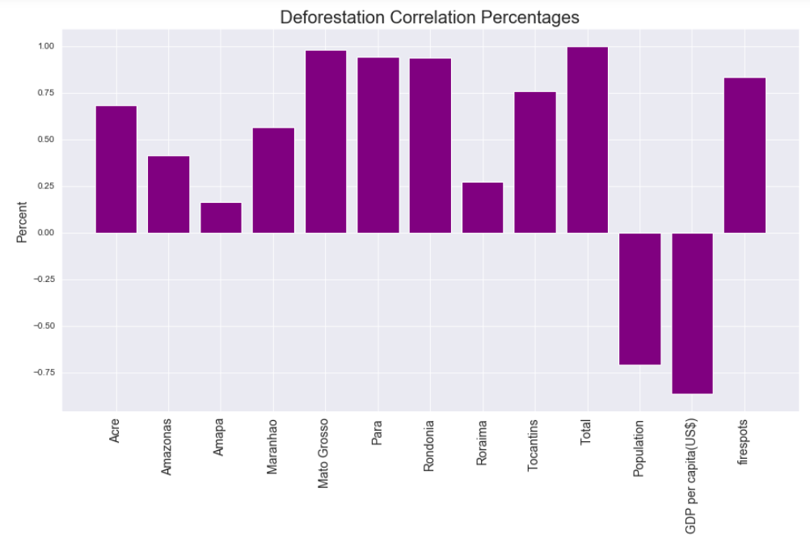

# The Amazon Rainforest and the Impact of Deforestation

Author: James Stipanowich

## Project Overview

The Amazon rainforest is disappearing at an alarming rate. Each year thousands of kilometers of rainforest are destroyed. The Amazon rainforest is the world's biggest rainforest.  The Amazon rainforest offers a huge, living ecosystem that holds about 30 percent of the world's species. The Amazon sustains many people, animal, and plant varieties. What happens if the developing life in this part of the world is destroyed? What massive repercussions could there be on the world as a whole? The Amazon has the power to create its own weather. How will weather patterns change if the Amazon is destroyed? What if people attempt to overtake nature and destroy the Amazon by human means? How will the deforestation of the Amazon influence many aspects of life such as the conquests for forest fires, the configurations of weather phenomena, the growth of population, and the expansion of GDP? Will the Amazon rainforest still exist in years to come if deforestation continues? 

## Business Problem

For this project I am acting as a data scientist with a wildlife organization in Brazil to determine if Amazon deforestation is increasing. I want to determine what factors are impacting the deforestation of the Amazon and on what scale their impact lies.  I plan to predict whether forest fires are correlated with and impacting deforestation and what patterns lie in the occurrences of forest fires for a variety of Brazilian states.

## The Data

The data for my project came from a variety of different sources. 

I compiled three Kaggle datasets for my project from https://www.kaggle.com/mbogernetto/brazilian-amazon-rainforest-degradation. The first Kaggle dataset on Amazon deforestation was originally sourced from The Brazilian Amazon Rainforest Monitoring Program by Satellite. The dataset contains 16 rows and 11 columns. The second Kaggle dataset about fire outbreaks came from The Fires Database at The National Institute for Space Research. The dataset holds 16 rows and 4 columns. The third Kaggle dataset on weather phenomena was initially derived from Golden Gate Weather Services. The dataset has 2104 rows and 6 columns.

I obtained additional data of Brazilian population statistics from https://www.macrotrends.net/countries/BRA/brazil/population. 

I used data of Brazil GDP statistics from The World Bank Group at https://data.worldbank.org/indicator/NY.GDP.PCAP.CD?end=2019&locations=BR&start=1960&view=chart.

All data I included occurred between the years 1999 and 2019.

## Data Preparation

I desired to identify how Amazon deforestation as a whole associates with the deforestation totals for each Brazilian state, weather phenomena, forest fires, population, and GDP(US dollars). I constructed a variety of plots and graphs to look at each of the mentioned features in relation to Amazon deforestation totals between 1999-2019.

Weather phenomena was found to have little correlation with Amazon deforestation between 1999-2019 so I did not include this element of analysis when I went on to further analysis and modeling.

I created a dataset to look at the correlation of the other deforestation impacting features in comparison with Amazon deforestation as a whole. My correlation plot is as follows:

The deforestation amounts for the Brazilian states of Mato Grosso, Para, and Rondonia were the most correlated with total Amazon deforestation amounts across all states.  These states are pretty large states so holding high correlation percentages with total Amazonian deforestation is not unusual. Firespots were about 83% correlated with the Amazon deforestation total suggesting a strong relationship between fire outbreaks and Amazonian deforestation. Fire outbreaks may lead to deforestation. Population and GDP per capita(US dollars) had strong inverse correlations with total deforestation. The more the Amazon was deforested, the less population and GDP per capita(US dollars). Population was about 71% inversely correlated with total Amazon deforestation and GDP per capita(US dollars) was about 86% inversely correlated with total Amazon deforestation. Amazon deforestation driving down population sadly makes sense. Deforestation of the Amazon bringing down GDP per capita(US dollars) could be concerning as well.

I used the correlation plotted features that relate to Amazon deforestation when I went on to modeling. 

## Data Modeling

After trying different models and code, I chose to go with three different paths to retrieving top 5 movie recommendations. The best model for attaining top 5 movie recommendations was the SVD model.

For my recommendation system methods I decided to find recommendations for user 43 in the dataset who watched the movie, "Toy Story," and rated the movie a '5'. This was a highly rated film and I wanted to find similar such films through recommendation systems.

The SVD model had a solid RMSE of .8724. The SVD model is the best of the models I created with predicted values not far off from actual true values. SVD can deal with a cold start because it provides accurate estimated ratings for unwatched movies. The SVD model had the lowest RMSE of my models. Predictions can be made for any movie in the dataset for user 43 or for any other user. The recommendations provided were highly rated movies. Most movies recommended were released around the same year "Toy Story" was released. 

The KNN model had a higher RMSE than the SVD model. The KNN model determined five similar neighbor users to user 43 who watched the movie, "Toy Story." Most of the movie recommendations from this system were movies released around the same year that Toy Story was released that had high ratings.

The function-based built out method used a Euclidean distance metric to calculate user similarities. The function took out movies that were already watched by the user to increase the chance of unique movie recommendations. The function sorted the movies to only mostly recommend movies rated a '5' to keep with the theme of recommending only highly rated movies.

## Conclusions

- Make appropriate preparations for the seasonality trends of firespots.

- Employ efforts to enforce stronger fire restrictions during strong firespot season.

## Recommendations for Further Analysis

- Incorporate and analyze satellite image classification information that show different activities relating to deforestation and whether or not deforestation is occurring at given times. These images aid in dertermining when deforestation is happening.

## For More Information

See the full analysis of my findings in Amazon.ipynb

Contact me at jmstipanowich@gmail.com

## Repository Structure

├── Images

├── README.md

├── RecommendationSystems.pdf

├── Recommendations.ipynb

